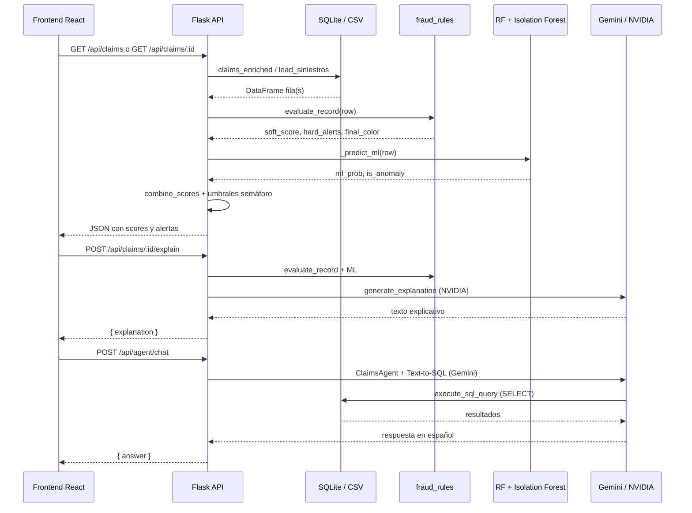

# Documentación Técnica — Fraudia Claims

Prototipo de triaje y detección de posible fraude en siniestros para el HackIAthon 2026 (Reto Aseguradora del Sur). Este documento describe únicamente la arquitectura y el código existentes en el repositorio.

---

# 1. Descripción Técnica General

**Fraudia Claims** es un sistema de **triaje asistido por IA** sobre una cartera de siniestros de seguros. No ejecuta decisiones automáticas de fraude; calcula scores de riesgo, activa alertas y genera explicaciones para revisión humana.

## Qué hace el sistema (técnicamente)

1. Carga siniestros desde CSV procesados y/o SQLite (`fraudia.db`).
2. Evalúa cada siniestro con un **motor híbrido**:
   - Reglas de negocio duras (RF01–RF07) y blandas (puntaje 0–100).
   - Modelos ML opcionales: Random Forest (probabilidad) e Isolation Forest (anomalía).
3. Combina reglas + ML en un **score final 0–100** con semáforo (`verde` / `amarillo` / `rojo`).
4. Expone resultados vía **API REST Flask**.
5. La UI **React + Vite** consume la API para dashboard, analizador, agente conversacional y grafo de relaciones.
6. Servicios externos de IA:
   - **Gemini** (`gemini-3.1-flash-lite`): agente conversacional con Text-to-SQL.
   - **NVIDIA API** (`google/gemma-3n-e4b-it`): explicaciones de score en el analizador.

## Flujo principal

```
Usuario (React) → HTTP /api/* → Flask Blueprint
  → Carga datos (SQLite / CSV)
  → evaluate_record() [reglas RF01–RF07 + soft score]
  → _predict_ml() [RF + Isolation Forest, si existen modelos]
  → combine_scores() [40% reglas + 60% ML]
  → JSON → UI (tabla, analizador, grafo, chat)
```

## Interacción frontend / backend / IA

| Capa | Rol |
|------|-----|
| **Frontend** | Navegación SPA, filtros, visualización, chat, exportaciones |
| **Backend Flask** | Orquestación, evaluación determinista, persistencia SQLite |
| **ML local** | Inferencia con `.joblib` (scikit-learn) |
| **Gemini** | Agente RAG + function calling SQL |
| **NVIDIA API** | Generación de texto explicativo del score |

---

# 2. Arquitectura del Proyecto

## Estructura general de carpetas

```text
fraudia-claims-web/
├── backend/
│   ├── app.py                    # Entry point Flask (factory + dev server)
│   ├── requirements.txt
│   ├── scripts/                  # ETL, entrenamiento, generación sintética
│   ├── src/
│   │   ├── api/                  # Blueprints REST
│   │   ├── rules/                # Motor de reglas RF01–RF07
│   │   ├── features/             # Feature engineering + grafos
│   │   ├── models/               # Scripts de entrenamiento ML
│   │   ├── explainability/       # Scoring híbrido + explicación IA
│   │   ├── ai_agent/             # Agente conversacional Gemini
│   │   ├── ingestion/            # Carga de CSVs
│   │   ├── storage/              # SQLite (fraudia.db)
│   │   ├── integrations/         # Notion
│   │   └── app/main.py           # UI alternativa Streamlit (legacy)
│   └── tests/
├── frontend/
│   ├── src/
│   │   ├── components/           # Vistas React
│   │   ├── hooks/                # useClaims, useClaim
│   │   └── services/api.ts       # Cliente HTTP centralizado
│   └── vite.config.ts            # Proxy /api → localhost:5000
├── data/processed/               # CSVs operativos (siniestros, pólizas, etc.)
├── fraudia.db                    # SQLite generado en runtime (raíz del repo)
├── .env                          # GEMINI_API_KEY, NVIDIA_API_KEY, Notion
└── Dockerfile                    # Despliegue backend con Gunicorn
```

## Módulos principales y responsabilidades

### Frontend
- **React 19 + Vite 8 + TypeScript + Tailwind CSS**
- SPA con `react-router-dom`: Dashboard, Analizador, Agente, Red, Entidades
- Cliente API en `frontend/src/services/api.ts`

### Backend
- **Flask 3** con factory pattern (`create_app()`)
- Blueprints modulares bajo `/api/*`
- CORS habilitado para desarrollo local
- En producción puede servir el build de React desde `frontend/dist` (catch-all en `app.py`)

### IA / ML
- **Reglas**: `src/rules/fraud_rules.py`
- **Features**: `src/features/build_features.py`, `graph_features.py`
- **Entrenamiento**: `src/models/fraud_model.py`, `anomaly_model.py`
- **Inferencia + explicación**: `src/explainability/explain_score.py`
- **Agente**: `src/ai_agent/claims_agent.py`

### Almacenamiento
- **CSVs** en `data/processed/` (fuente primaria de datos)
- **SQLite** `fraudia.db` materializado desde CSVs (`ensure_relational_db`)
- **Modelos** `.joblib` esperados en `backend/models/` (no incluidos en el repo)

## Flujo interno del sistema

```
data/processed/*.csv
       │
       ├─► load_data.py (normalización de columnas)
       │
       ├─► build_features.py → siniestros_processed.csv (features + grafos + embeddings)
       │
       ├─► train scripts → *.joblib (manual)
       │
       └─► relational_db.py → fraudia.db + vista claims_enriched
                │
                ▼
         API endpoints → evaluate_record + _predict_ml → JSON
```

---

# 3. Backend

## Flask y arranque

- **Archivo de entrada**: `backend/app.py`
- **Factory**: `create_app()` registra blueprints, configura CORS y ruta catch-all para SPA
- **Desarrollo**: `python backend/app.py` → `http://0.0.0.0:5000`
- **Producción (Docker)**: Gunicorn sobre `backend.app:create_app()` en puerto 10000

Variables de entorno cargadas desde `.env` en la raíz del proyecto (`python-dotenv`).

## Blueprints registrados

| Blueprint | Prefijo | Archivo |
|-----------|---------|---------|
| `health_bp` | `/api` | `src/api/health.py` |
| `claims_bp` | `/api/claims` | `src/api/claims.py` |
| `agent_bp` | `/api/agent` | `src/api/agent.py` |
| `network_bp` | `/api/network` | `src/api/network.py` |
| `entities_bp` | `/api/entities` | `src/api/entities.py` |
| `reports_bp` | `/api/reports` | `src/api/reports.py` |
| `notion_bp` | `/api/notion` | `src/api/notion.py` |
| `search_bp` | `/api/search` | `src/api/search.py` |

## Endpoints principales

### Salud
- `GET /api/health` — Liveness probe (`status: ok`)

### Siniestros (`claims_bp`)
- `GET /api/claims` — Lista paginada con evaluación completa (reglas + ML). Query: `page`, `limit`, `color`
- `GET /api/claims/<id>` — Detalle + evaluación + documentos relacionados
- `POST /api/claims/<id>/evaluate` — Re-ejecuta pipeline de evaluación
- `POST /api/claims/<id>/explain` — Genera explicación IA (NVIDIA API)
- `POST /api/claims/manual` — Inserta siniestro manual en SQLite
- `GET /api/claims/<id>/documentos/<doc_id>/preview` — Sirve PDF asociado al documento

### Agente
- `POST /api/agent/chat` — Body: `{ "question": "..." }` → respuesta Gemini
- `POST /api/agent/export_pdf` — Exporta conversación a PDF (fpdf2)

### Red
- `GET /api/network/graph` — Nodos y aristas JSON (top 15 siniestros rojo/amarillo)

### Entidades
- `GET /api/entities/providers` — Métricas de riesgo por proveedor

### Reportes
- `GET /api/reports/stats` — KPIs agregados (ahorro potencial, heatmap sucursal, riesgo por ramo)

### Búsqueda
- `GET /api/search?q=` — Búsqueda global en siniestros, pólizas, proveedores, asegurados

### Notion
- `POST /api/notion/export` — Exporta siniestros seleccionados a base Notion

## Lógica de evaluación

1. **`evaluate_record(row)`** (`fraud_rules.py`):
   - Ejecuta RF01–RF07 (hard rules).
   - Calcula `soft_score` (0–100) con 15 criterios ponderados.
   - Asigna `final_color` y `final_score` según reglas duras o umbrales de soft score.

2. **`_apply_ml_to_evaluation()`** (`claims.py`):
   - Llama `_predict_ml()` para probabilidad RF y flag de anomalía ISO.
   - Si `is_anomaly`: añade alerta y +15 pts al soft score (máx. 100).
   - `combine_scores(soft_score, ml_prob)` → score híbrido.
   - Recalcula semáforo: rojo ≥80, amarillo ≥50, verde <50.

**Nota:** Los umbrales del API post-ML difieren de los de `evaluate_record()` aislado (40/75 en reglas puras).

## Reglas de negocio

Implementadas en `src/rules/fraud_rules.py`:

| Código | Tipo | Efecto |
|--------|------|--------|
| RF01 | Hard | Robo + pérdida total → rojo |
| RF02 | Hard | Documento alterado → rojo |
| RF03 | Hard | Lista restrictiva de proveedores → rojo |
| RF04 | Hard | Dinámica físicamente imposible → rojo |
| RF05 | Hard | Siniestro ≤48 h del inicio/fin de póliza → amarillo |
| RF06 | Hard | Robo reportado >4 días → amarillo |
| RF07 | Hard | Narrativa clonada (similitud ≥85%) → amarillo |

Soft rules adicionales: frecuencias, documentos, montos, grafos (`alerta_red_fraude`), etc.

## Integración con IA

- **Explicaciones**: `generate_explanation()` → NVIDIA Integrate API (`google/gemma-3n-e4b-it`). Fallback textual si falla o falta `NVIDIA_API_KEY`.
- **Agente**: `ClaimsAgent.answer_question()` → Google GenAI SDK, modelo `gemini-3.1-flash-lite`, con tool `execute_sql_query` (Text-to-SQL restringido a SELECT/PRAGMA).

## SQLite

- **Ruta**: `fraudia.db` en la raíz del repositorio
- **Creación**: `ensure_relational_db()` — idempotente; carga CSVs si las tablas no existen
- **Tablas**: `siniestros`, `polizas`, `asegurados`, `proveedores`, `documentos`
- **Vista**: `claims_enriched` — JOIN de siniestros con asegurado, póliza y proveedor
- **Script manual**: `backend/scripts/create_sqlite.py`

## APIs externas

| Servicio | Variable | Uso |
|----------|----------|-----|
| Google Gemini | `GEMINI_API_KEY` | Agente conversacional + Text-to-SQL |
| NVIDIA Integrate | `NVIDIA_API_KEY` | Explicaciones de score |
| Notion | `NOTION_API_KEY`, `NOTION_DATABASE_ID` | Exportación de siniestros |

## UI alternativa (Streamlit)

Existe `backend/src/app/main.py`: dashboard Streamlit con funcionalidad similar (PyVis, Gemini, PDF). **No es la UI principal desplegada**; la interfaz activa del hackathon es React.

---

# 4. Frontend

## Stack

- **React 19.2**, **Vite 8**, **TypeScript 6**
- **react-router-dom 7** — enrutamiento SPA
- **Tailwind CSS 3** — estilos
- **lucide-react** — iconos
- **react-markdown** — render de explicaciones IA
- Dependencia `react-force-graph-2d` presente en `package.json`; la vista de red usa simulación física propia en canvas/SVG, no esta librería directamente en `NetworkView.tsx`

## Estructura

```text
frontend/src/
├── main.tsx           # BrowserRouter + App
├── App.tsx            # Layout (Sidebar + TopBar + Routes)
├── components/
│   ├── Dashboard.tsx
│   ├── ClaimAnalyzer.tsx
│   ├── AgentView.tsx
│   ├── NetworkView.tsx
│   ├── EntitiesView.tsx
│   ├── Sidebar.tsx
│   └── TopBar.tsx
├── hooks/useClaims.ts
└── services/api.ts
```

## Vistas y rutas

| Ruta | Componente | Función |
|------|------------|---------|
| `/` | `Dashboard` | KPIs, tabla de siniestros, filtros, alta manual, export CSV/Notion |
| `/analyzer?id=` | `ClaimAnalyzer` | Detalle, scores, alertas, documentos, explicación IA |
| `/agent` | `AgentView` | Chat con agente Gemini, sesiones en localStorage, export PDF |
| `/network` | `NetworkView` | Grafo interactivo (fetch + simulación de fuerzas) |
| `/entities` | `EntitiesView` | Directorio de proveedores con métricas de riesgo |

Rutas no definidas muestran placeholder "En construcción...".

## Consumo de APIs

Centralizado en `frontend/src/services/api.ts`:

- **Base URL**: `VITE_API_URL` o por defecto `https://fraudia-claims-web.onrender.com`
- **Desarrollo local**: proxy Vite redirige `/api` → `http://localhost:5000`

Funciones principales: `fetchClaims`, `fetchClaim`, `explainClaim`, `chatWithAgent`, `fetchNetworkGraph`, `searchGlobal`, `getProviderRisk`, `exportToNotion`, `exportAgentPdf`, `createManualClaim`.

Hooks `useClaims` / `useClaim` encapsulan estado loading/error/refetch.

## Navegación y búsqueda

- **Sidebar**: links `NavLink` a las 5 vistas principales
- **TopBar**: búsqueda global (`searchGlobal`) con dropdown de resultados; navega al analizador, entidades o dashboard filtrado
- **Dashboard**: filtros por semáforo, sucursal, ramo, documentos pendientes; tabs "Todos", "En revisión", "Pendiente documentación"

## Componentes relevantes

- **Dashboard**: paginación client-side, selección múltiple, exportación CSV, modal de alta manual (`POST /api/claims/manual`)
- **ClaimAnalyzer**: anillo de score, drawer de explicación (`explainClaim`), preview de PDFs vía API
- **AgentView**: historial de sesiones en `localStorage`, sugerencias predefinidas, export PDF del chat
- **NetworkView**: top 15 claims de riesgo, filtros por tipo de nodo, zoom/pan
- **EntitiesView**: tarjetas de proveedor con tasa de siniestralidad (% rojos)

---

# 5. Inteligencia Artificial y Machine Learning

## Isolation Forest

- **Entrenamiento**: `src/models/anomaly_model.py`
- **Algoritmo**: `sklearn.ensemble.IsolationForest` (100 estimadores, `contamination=0.05`)
- **Features** (11 numéricas): montos, días de vigencia/reporte, frecuencias, similitud narrativa, etc.
- **Persistencia**: `isolation_forest.joblib` + `anomaly_features.joblib`
- **Uso en runtime**: `_predict_ml()` — predicción `-1` → `is_anomaly=True`; suma +15 al soft score y alerta en UI

**Limitación:** Los archivos `.joblib` no están en el repositorio. Sin entrenamiento previo, la detección de anomalías no opera (`is_anomaly=False`).

## Random Forest

- **Entrenamiento**: `src/models/fraud_model.py`
- **Algoritmo**: `RandomForestClassifier` (100 árboles, `max_depth=10`, `class_weight=balanced`)
- **Target**: `etiqueta_fraude_simulada` (etiqueta sintética)
- **20 features** estructuradas (montos, frecuencias, flags documentales, narrativa, etc.)
- **Persistencia**: `random_forest_fraud.joblib` + `features.joblib`
- **Uso**: `predict_proba[:, 1]` → input del scoring híbrido (60% del peso)

**Limitación:** Modelo no incluido en el repo. Pipeline de entrenamiento: `backend/scripts/train_model.py` (features → RF). Sin modelo, `ml_prob=0.0`.

## Sentence Transformers y embeddings

- **Modelo**: `paraphrase-multilingual-MiniLM-L12-v2`
- **Feature engineering** (`build_features.py`): encode de todas las descripciones → matriz de similitud coseno → `narrativa_similitud_score` y flag `narrativa_clonada` (≥0.85)
- **Agente** (`claims_agent.py`): embeddings en memoria para retrieval semántico (`_retrieve_similar_claims`) ante preguntas largas sin ID explícito

**Limitación:** Primera carga del agente descarga el modelo Sentence Transformers (~420 MB); impacto en cold start.

## Similitud semántica

- Cálculo offline en ETL con `cosine_similarity` sobre embeddings
- Alimenta RF07 (hard rule) y soft rules (umbrales 70%/85%)
- El agente reutiliza embeddings para contexto RAG adicional

## Scoring híbrido

```python
# explain_score.combine_scores()
total = int(round(rule_score * 0.40 + (ml_prob * 100) * 0.60))
# Rango: 0–100
```

- **40%** puntaje de reglas blandas
- **60%** probabilidad del Random Forest
- Reglas duras pueden elevar el score mínimo antes de combinar
- API recalcula semáforo con umbrales 50/80

## Text-to-SQL

- Función `execute_sql_query()` expuesta como **tool** al agente Gemini
- Solo permite `SELECT` y `PRAGMA`
- Ejecuta contra `fraudia.db`, devuelve máximo 50 filas en Markdown
- El agente recibe esquema dinámico de tablas en el system prompt

## Gemini

- **SDK**: `google-genai`
- **Modelo**: `gemini-3.1-flash-lite`
- **Uso**: chat analítico en español, function calling para SQL, contexto precomputado (`dataset_summary`) + retrieval semántico
- **Requisito**: `GEMINI_API_KEY` en `.env`

## NVIDIA API

- **Endpoint**: `https://integrate.api.nvidia.com/v1/chat/completions`
- **Modelo**: `google/gemma-3n-e4b-it`
- **Uso exclusivo**: `generate_explanation()` — justificación del score para el analizador
- **Requisito**: `NVIDIA_API_KEY`
- **Nota**: Los comentarios del código mencionan "Gemini" en explicaciones, pero la implementación real usa NVIDIA API.

## Análisis de grafos

- **Librería**: NetworkX (`graph_features.py`)
- **Grafo**: nodos Asegurado ↔ Vehículo ↔ Proveedor conectados por siniestros
- **Heurística de carrusel**: componente conectada con ≥3 siniestros y >1 asegurado o >1 vehículo → `alerta_red_fraude=1` (+15 pts soft score)
- **Visualización API** (`network.py`): subgrafo de top 15 siniestros rojo/amarillo con nodos claim, insured, provider, vehicle
- **Visualización frontend**: simulación de fuerzas custom (no NetworkX en cliente)

## Reglas RF01–RF07

Documentadas en sección 3. Las features que las alimentan se generan en `build_features.py` y en el script de datos sintéticos (`generate_synthetic.py`), que inyecta patrones para activar reglas.

---

# 6. Flujo Completo del Sistema



**Resumen:** El frontend solicita datos → Flask carga filas → motor de reglas → ML opcional → score combinado → respuesta JSON. Explicaciones y chat delegan en APIs externas con contexto estructurado del siniestro.

---

# 7. Base de Datos y Persistencia

## SQLite (`fraudia.db`)

- Generado automáticamente en primer acceso a endpoints que llaman `ensure_relational_db()`
- Ubicación: raíz del repositorio (`PROJECT_ROOT/fraudia.db`)
- Idempotente: si las 5 tablas existen, no reconstruye
- Siniestros manuales (`POST /api/claims/manual`) se insertan directamente en tabla `siniestros`

## CSV (`data/processed/`)

| Archivo | Contenido |
|---------|-----------|
| `siniestros.csv` | Reclamos base (separador `;`, UTF-8) |
| `siniestros_processed.csv` | Siniestros + features engineered (generado por `build_features.py`) |
| `polizas.csv` | Contratos |
| `asegurados.csv` | Clientes |
| `proveedores.csv` | Talleres, clínicas, peritos |
| `documentos.csv` | Documentación por siniestro |

`load_data.py` normaliza headers en español a nombres canónicos (`id_siniestro`, `monto_reclamado`, etc.).

## Generación de `fraudia.db`

1. CSVs en `data/processed/`
2. `ensure_relational_db()` lee via `load_*()` y ejecuta `to_sql()`
3. Crea índices y vista `claims_enriched`
4. Alternativa explícita: `python backend/scripts/create_sqlite.py`

## Modelos `.joblib`

Esperados en `backend/models/`:

- `random_forest_fraud.joblib` + `features.joblib`
- `isolation_forest.joblib` + `anomaly_features.joblib`

Generación:

```bash
python backend/src/features/build_features.py
python backend/src/models/fraud_model.py
python backend/src/models/anomaly_model.py
# o: python backend/scripts/train_model.py  (solo RF, tras features)
```

**Estado actual del repo:** ningún archivo `.joblib` versionado.

## Manejo de datos

- Datos **100% sintéticos** generados por `backend/scripts/generate_synthetic.py` (Faker, contexto ecuatoriano sur)
- Etiqueta supervisada: `etiqueta_fraude_simulada`
- PDFs de documentos referenciados en `documentos.csv`; preview busca en `data/raw/` recursivamente
- Existe copia de `siniestros_processed.csv` en `backend/data/processed/`; el loader oficial apunta a `data/processed/` en la raíz

---

# 8. Funcionalidades Implementadas

Funcionalidades verificadas en código (UI React + API):

| Funcionalidad | Estado | Detalle técnico |
|---------------|--------|-----------------|
| **Dashboard** | Implementado | KPIs, tabla paginada, filtros semáforo/sucursal/ramo, tabs de revisión |
| **Analizador de siniestros** | Implementado | Detalle, scores, alertas hard/soft, preview PDF, explicación NVIDIA |
| **Agente conversacional** | Implementado | Gemini + Text-to-SQL, sesiones localStorage, export PDF |
| **Red de relaciones** | Implementado | Top 15 riesgo, grafo interactivo, filtros por tipo de nodo |
| **Entidades (proveedores)** | Implementado | Métricas agregadas por proveedor |
| **Búsqueda global** | Implementado | TopBar + endpoint `/api/search` |
| **Filtros avanzados** | Implementado | Client-side en Dashboard + query `color` en API |
| **Alta manual de siniestros** | Implementado | Modal → `POST /api/claims/manual` |
| **Explicación IA** | Implementado | `POST /api/claims/:id/explain` (NVIDIA) |
| **Detección de anomalías** | Parcial | Requiere modelo ISO entrenado localmente |
| **Exportación CSV** | Implementado | Dashboard, selección múltiple |
| **Exportación Notion** | Implementado | Requiere credenciales Notion configuradas |
| **Exportación PDF agente** | Implementado | `POST /api/agent/export_pdf` |
| **Reportes agregados** | Backend only | `GET /api/reports/stats` definido; **no consumido** por componente React |
| **Re-evaluación explícita** | Backend only | `POST /api/claims/:id/evaluate` definido; evaluación ocurre en GET list/detail |
| **Settings / Help** | Placeholder | Links deshabilitados en Sidebar |
| **UI Streamlit** | Alternativa | `backend/src/app/main.py`, no integrada al flujo React principal |

---

# 9. Limitaciones Técnicas Reales

1. **Agente conversacional (Gemini free/tier gratuito)**
   - Depende de `GEMINI_API_KEY` y disponibilidad de la API.
   - Modelo `gemini-3.1-flash-lite`: puede responder **lento**, de forma **inconsistente** o con límites de rate en tier gratuito.
   - Cold start elevado: carga Sentence Transformers + resumen del dataset en memoria.

2. **Datos sintéticos**
   - Toda la cartera proviene de generación sintética (`generate_synthetic.py`).
   - La etiqueta `etiqueta_fraude_simulada` no refleja fraude real.
   - Métricas de ML no son representativas de producción.

3. **Componentes prototipo**
   - Streamlit (`main.py`) coexiste como UI legacy.
   - Settings/Help sin implementar.
   - `getReportStats` y `evaluateClaim` expuestos en API client pero sin uso en UI.
   - Dockerfile despliega solo backend; frontend en dev apunta por defecto a Render.

4. **Random Forest no completamente desplegado**
   - Archivos `.joblib` **ausentes** del repositorio.
   - Sin entrenamiento manual, `ml_prob=0.0` y el 60% del score híbrido no aporta señal ML.
   - El Streamlit asume modelo cargado; muestra mensaje optimista aunque el archivo no exista.

5. **Isolation Forest igualmente opcional**
   - Sin `isolation_forest.joblib`, no hay detección de anomalías en runtime.

6. **El sistema NO toma decisiones automáticas de fraude**
   - Solo genera scores, alertas y texto explicativo.
   - Semáforos son indicadores de triaje; no hay endpoints de rechazo de pago ni workflow de resolución.

7. **Rendimiento**
   - `GET /api/claims` re-evalúa **todos** los siniestros en cada request (bucle + ML bulk). Con ~1000 registros es costoso.
   - Embeddings y modelos NLP/ML se cargan en memoria por proceso Flask/Gunicorn.

8. **Inconsistencias documentales vs código**
   - Explicaciones usan **NVIDIA API**, no Gemini (a pesar de comentarios en código).
   - Umbrales de semáforo difieren entre motor de reglas puro y capa API post-ML.

9. **Autenticación inexistente**
   - API pública sin auth; CORS permisivo (`origins: *`).

---

# 10. Posibles Mejoras

| Área | Mejora técnica coherente |
|------|--------------------------|
| **Autenticación** | JWT/OAuth2, roles analista/admin, protección de endpoints |
| **Despliegue cloud** | CI/CD con build de frontend + backend; variables de entorno gestionadas; health checks |
| **Optimización** | Precomputar y cachear scores en SQLite; paginar evaluación server-side; evitar re-evaluar dataset completo |
| **Cache** | Redis para resultados de evaluación, embeddings y respuestas frecuentes del agente |
| **Entrenamiento con datos reales** | Pipeline MLOps con datos anonimizados, validación temporal, monitoreo de drift |
| **Monitoreo** | Logging estructurado, métricas de latencia API/LLM, alertas de errores NVIDIA/Gemini |
| **Escalabilidad** | Workers async para inferencia ML; cola de jobs para explicaciones; separar servicio de agente |
| **Modelos** | Versionar `.joblib` o descarga automática en deploy; validar presencia en startup |
| **Consistencia** | Unificar umbrales de semáforo; alinear documentación con NVIDIA vs Gemini |
| **Tests** | Ampliar cobertura más allá de `test_rules.py` (API, ML, agente mockeado) |

---

# 11. Conclusión Técnica

Fraudia Claims implementa un **prototipo funcional de triaje híbrido** (reglas + ML + LLM) sobre datos sintéticos, con arquitectura clara **React ↔ Flask ↔ SQLite/CSV**. El motor de reglas RF01–RF07 y el feature engineering (embeddings, grafos NetworkX) están integrados en el flujo de evaluación. Las capacidades de IA conversacional (Gemini + Text-to-SQL) y explicabilidad (NVIDIA API) dependen de claves externas y tiers gratuitos con limitaciones operativas.

El sistema está diseñado como **copiloto de analista**: entrega scores, alertas y narrativas explicativas, pero requiere intervención humana para cualquier decisión. Para un entorno productivo sería necesario entrenar y desplegar los modelos `.joblib`, migrar a datos reales, añadir autenticación, optimizar la evaluación masiva y endurecer el despliegue full-stack.

---
