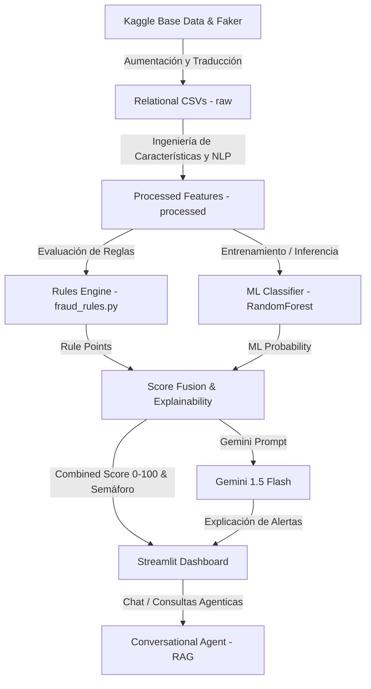

# Arquitectura del Sistema – Fraudia Claims

Este documento describe la arquitectura técnica, los componentes principales y el flujo de datos del prototipo funcional de **Fraudia Claims** desarrollado para el **HackIAthon 2026 – Reto Aseguradora del Sur**.

---

## 1. Vista General de la Arquitectura

Fraudia Claims utiliza un **enfoque híbrido** para la detección y explicación de posibles fraudes en siniestros de seguros. En lugar de depender de un único modelo, combina:
- **Lógica de Negocio Determinista**: Un motor de reglas basado en la rúbrica técnica oficial de la aseguradora.
- **Modelado Estadístico Predictivo**: Un clasificador supervisado de Machine Learning que detecta patrones anómalos.
- **Procesamiento de Lenguaje Natural (NLP)**: Análisis de similitud textual para identificar narrativas clonadas.
- **Inteligencia Artificial Generativa**: Explicaciones automatizadas y un agente conversacional interactivo utilizando Gemini.

---

## 2. Componentes del Sistema

### 2.1. Ingestión y Enriquecimiento de Datos (`src/ingestion/`, `scripts/`)
- **`generate_synthetic.py`**: Lee el archivo `insurance_claims.csv` (Kaggle) y aplica técnicas de aumentación para generar un conjunto de datos relacionales en español con contexto de Ecuador (Loja, Cuenca, Machala, Zamora, Azogues).
- **`load_data.py`**: Expone funciones modulares para cargar las tablas relacionales de pólizas, asegurados, siniestros, proveedores y documentos.

### 2.2. Ingeniería de Características (`src/features/`)
- **`build_features.py`**: Calcula variables críticas:
  - Frecuencias relacionales de siniestros por asegurado, vehículo y conductor en ventanas móviles de 18 meses.
  - Tiempos de reporte de siniestros y proximidad a las fechas de vigencia de pólizas.
  - Similitud de textos utilizando una matriz TF-IDF y similitud de coseno para detectar narrativas clonadas (RF07).

### 2.3. Motor de Reglas (`src/rules/`)
- **`fraud_rules.py`**: Evalúa de forma determinista 7 reglas duras (RF01 - RF07) que disparan un color de semáforo (Rojo o Amarillo) de forma directa, y acumula puntos de reglas blandas de acuerdo a la rúbrica oficial.

### 2.4. Modelo de Inteligencia Artificial (`src/models/`)
- **`fraud_model.py`**: Entrena un clasificador `RandomForestClassifier` de Scikit-Learn. El modelo aprende las correlaciones estadísticas y predice la probabilidad de fraude de manera cuantitativa (0.0 a 1.0).

### 2.5. Explicabilidad y Fusión de Scores (`src/explainability/`)
- **`explain_score.py`**: Une los resultados del motor de reglas (40% de peso) y del modelo de Machine Learning (60% de peso) en un Score de Riesgo unificado de 0 a 100.
- Llama a la API de **Gemini 1.5 Flash** inyectando las alertas activadas, montos, variables y narrativas, generando un informe de justificación técnica y ética en español.

### 2.6. Agente Conversacional (`src/ai_agent/`)
- **`claims_agent.py`**: Implementa una interfaz de RAG estructurado. Mapea la base de datos completa de siniestros, detecta la intención del usuario y utiliza Gemini para responder consultas complejas en lenguaje natural (ej. rankings de talleres, siniestros con mayor riesgo, etc.).

### 2.7. Interfaz de Usuario (`src/app/`)
- **`main.py`**: Aplicación Streamlit con diseño Notion-like, grids de KPIs, tabla interactiva con filtros, grafos de redes de colisión (PyVis) y un chat conversacional integrado.

---

## 3. Flujo de Datos para Evaluación de un Siniestro

1. El usuario ingresa o selecciona un siniestro.
2. El sistema recupera el registro y sus relaciones (póliza, asegurado, proveedor, documentos).
3. **Paso A**: Se ejecuta `fraud_rules.py` y se obtienen los puntos acumulados y las alertas de reglas duras/blandas.
4. **Paso B**: Se procesan las características y el modelo de Random Forest calcula la probabilidad de fraude.
5. Ambos scores se fusionan en un score final de 0 a 100 y se le asigna un color (Verde, Amarillo, Rojo).
6. Si el analista lo solicita, el sistema envía un prompt a Gemini que genera y muestra la justificación explicable en el dashboard en menos de 2 segundos.
